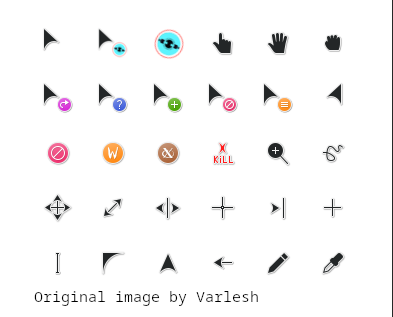

# Cyber-Volantes Cursors (Dark)
This is the Volantes dark cursor pack, modified with Cyberpunk 2077 icons. Currently, it is limited to only the "spinning disk" loading animation, but it will be expanding to cover more. The source file for the animation was sourced from the Daemon 2.0 Plasma theme. These are fully animated at 24fps and available in 64px, 48px, 32px, or 24px sizes.

It is only available with dark theme cursors at the moment. I may make this for the light theme cursors as well if anyone shows interest.

To make your system look even more Cyberpunk, the [Daemon 2.0](https://github.com/MathisP75/daemon-kde-mk2) Plasma theme and colour scheme looks amazing with these cursors.

#### Differences from source

The progress and wait cursors (animated loading cursors) have had their animations replaced with the Cyberpunk 2077 loading animation (pictured).




## Install

Available on pling: https://www.opendesktop.org/p/2365992/

You can also download the latest release, and copy the extracted folder to your ~/.icons/ folder.

The compiled X11 cursors (progress and wait) are also included in the source code main folder for anyone who wishes to use them individually.

The following are the manual installation instructions from the original project, which should work just the same for this fork as I made sure to keep everything consistent. However, I did not use this method to source the original content so I cannot say for sure whether the original script functions as intended.

1. Install dependencies:

    - git
    - make
    - inkscape
    - xcursorgen
    
Fedora:

    ```
    sudo dnf install git make inkscape xcursorgen
    ```

Ubuntu:

    ```
    sudo apt install git make inkscape xcursorgen
    ```

2. Run the following commands as normal user:

    ```
    git clone https://github.com/varlesh/volantes-cursors.git
    cd volantes-cursors
    make build
    sudo make install
    ```

3. Choose a theme in the Settings or in the Tweaks tool.

#### License & Attributions

This project is a customized fork of the original [Volantes Cursors](https://github.com/varlesh/volantes-cursors), which was originally licensed under GPL-2.0-or-later. 
To accommodate the GPL-3.0 licensed image assets, and as permitted by the original project's "or later" clause, this entire modified repository is now distributed under the [GNU General Public License v3.0](LICENSE).

#### Third-Party Assets
* **Images & Graphics:** Sourced from [Daemon 2.0](https://github.com/MathisP75/daemon-kde-mk2), which is licensed under the GPL-3.0. 
